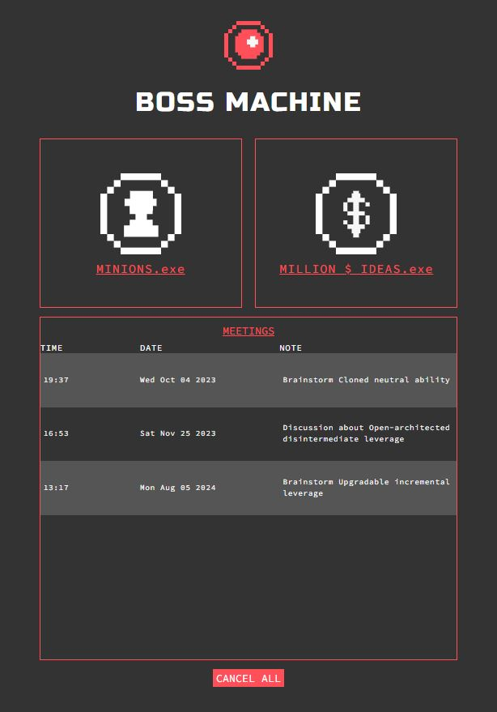

# Boss Machine - Workforce and Idea Management System

## Description

Boss Machine is a web application developed as part of the Codecademy Full Stack Career Path's project called **Boss Machine**. This project focuses on building a workforce and idea management system that enables users to manage minions, business ideas, meetings, and more.

**Purpose:** The main goal of Boss Machine is to showcase the skills acquired during the Codecademy course, particularly in full-stack development. The application provides a practical platform for users to manage their workforce and business ideas efficiently.

**Technologies:** The project utilizes various technologies to create a functional and dynamic web application:

- **Node.js:** The JavaScript runtime used to develop the server-side components of the application.
- **Express.js:** A web application framework for Node.js, used to build robust APIs and handle HTTP requests.
- **SQLite:** A lightweight relational database management system used to store and manage application data.
- **JavaScript:** The primary programming language for both front-end and back-end development.
- **HTML & CSS:** Used for creating the user interface and styling the application.
- **AJAX:** Asynchronous JavaScript and XML for seamless client-server communication.

## Features

Boss Machine encompasses the following features:

1. **Minions Management:** Users can view, create, update, and delete minions within the workforce.
2. **Ideas Management:** Users can manage business ideas, including addition, updating, and deletion of ideas.
3. **Meetings Scheduling:** Users can schedule and manage meetings, including creation and viewing of meetings.
4. **Idea Valuation:** The application includes a feature to evaluate whether an idea is worth a million dollars or not.

## Clarification on Contribution

My contribution to the project focused on the Express API handling part, involving the following files:

- `server.js`: Set up the Express server and configured routing.
- `api.js`: Implemented API routes and endpoints for various features.
- `minions.js`: Managed API routes related to minions' information.
- `ideas.js`: Handled API routes for managing business ideas.
- `meetings.js`: Created API endpoints for scheduling and managing meetings.
- `checkMillionDollarIdea.js`: Implemented functionality to evaluate whether an idea is worth a million dollars.

These files showcase My expertise in backend logic and API interactions, crucial for delivering the core functionalities of the Boss Machine project.

## Demo screenshot

## Contact

For questions or feedback, feel free to reach out at [abdelrahman.abdelaziz9@gmail.com].

Thank you for your contribution to the Boss Machine project!
